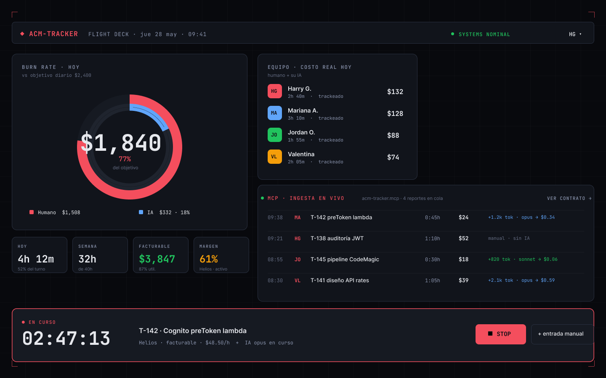
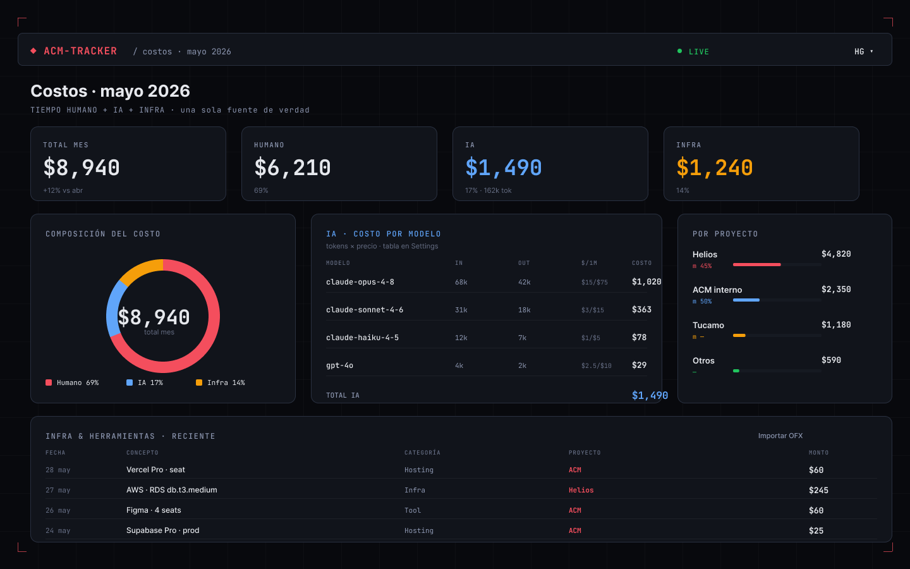
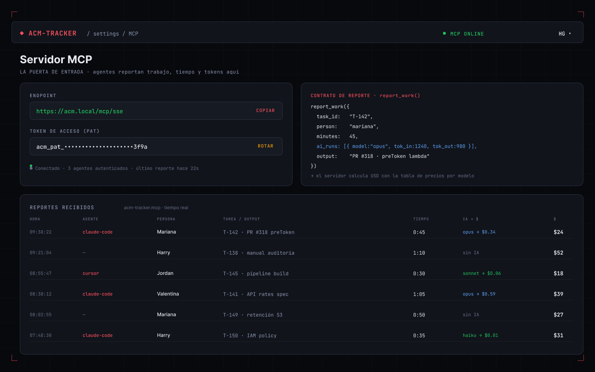
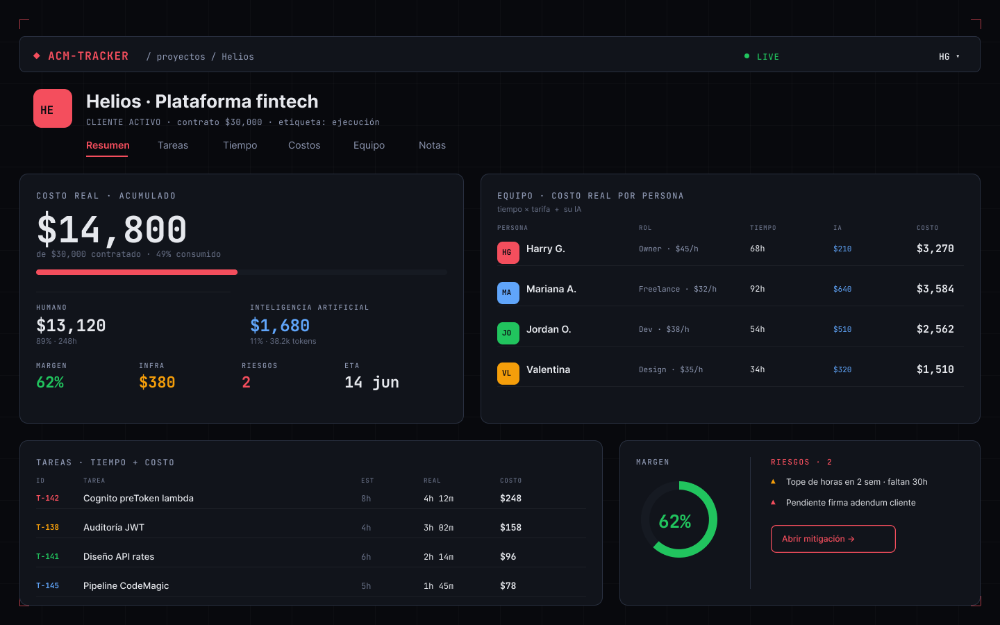
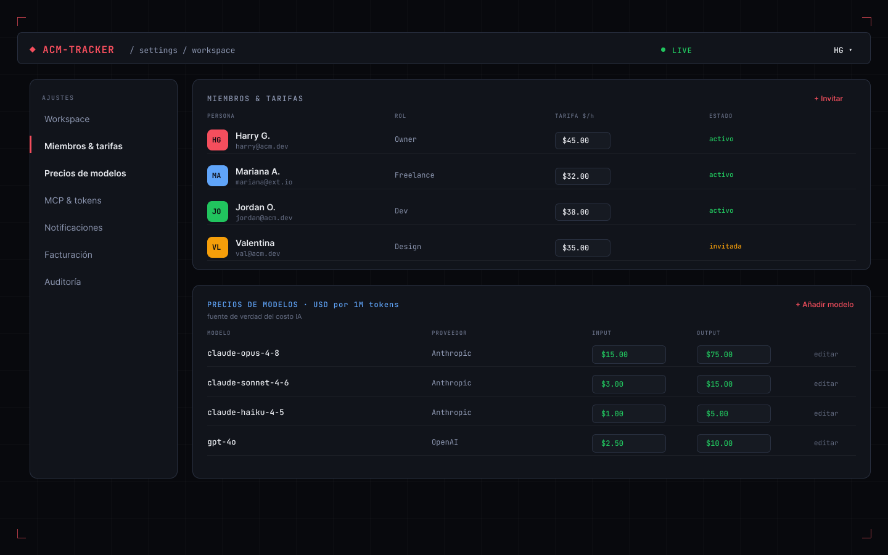
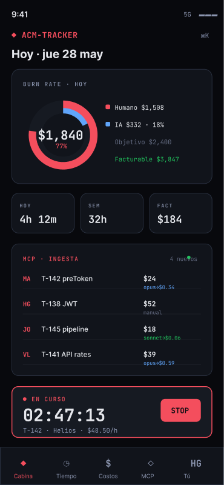

# ACM-TRACKER — Diseño (Flight Deck)

Mockups de referencia del set v1. Dirección visual **Flight Deck**: tema oscuro tipo cabina, gauges de anillo para burn rate, JetBrains Mono para datos + Inter para etiquetas, fondo de grid técnico. Proyecto de ejemplo: **Helios · Plataforma fintech**.

> Diseñados en Figma — página "ACM-TRACKER · Variations". Estos PNG son la fuente de verdad visual para la implementación.

## Cabina (Hoy)
Burn rate del día (gauge: coral = costo total vs objetivo, arco azul = IA), equipo como personas con costo real (humano + su IA), ingesta MCP en vivo, timer dock.

## Costos & IA
Composición del costo (humano/IA/infra), tabla de **IA por modelo** (tokens × precio → USD), costo por proyecto, infra reciente.

## Servidor MCP
Endpoint + token, contrato `report_work()`, reportes recibidos en tiempo real. (Fase 2.)

## Detalle de proyecto
Costo real acumulado con desglose humano/IA, equipo con costo por persona, tareas con tiempo+costo, gauge de margen, riesgos.

## Settings · miembros & precios
Miembros con tarifa $/h, tabla editable de **precios de modelos** (fuente de verdad del costo IA), sección de auth provider (deshabilitada en v1).

## Mobile (PWA)
Cabina condensada: mini gauge dual, tiles, feed MCP, timer, bottom nav.

